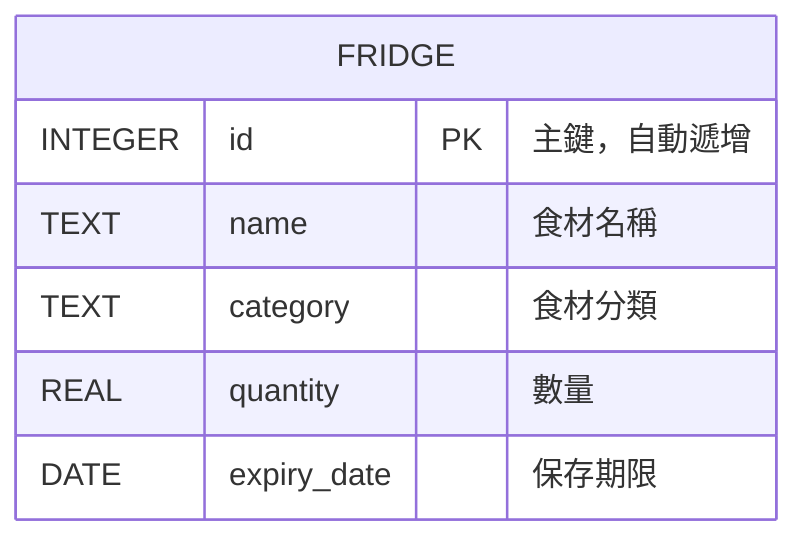
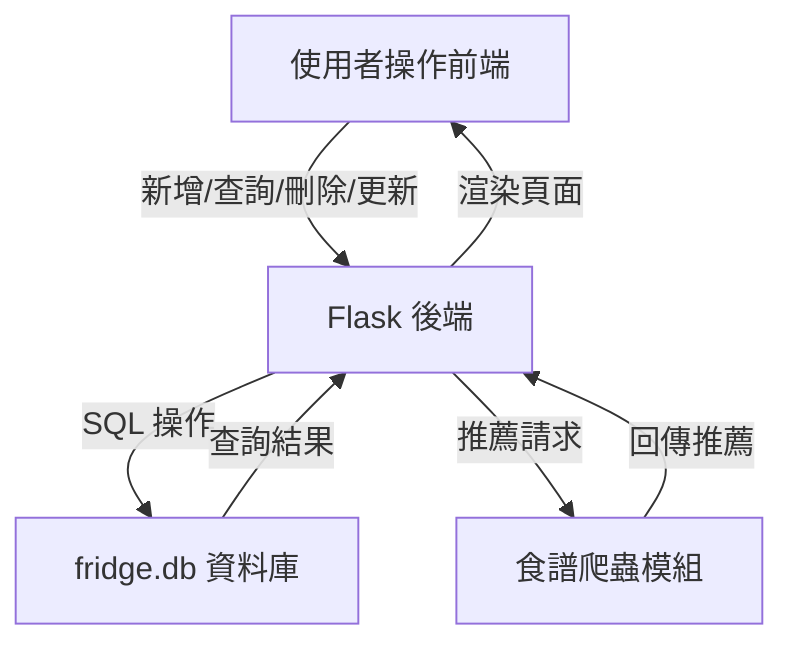

# 智慧冰箱食譜推薦系統

本專案是一個基於 Flask 的網頁應用，協助使用者管理家中冰箱食材，並根據現有食材推薦可製作的食譜，減少食材浪費並提升料理效率。

---

## 主要功能

- 食材管理：新增、刪除、查詢冰箱內的食材。
- 食譜推薦：根據現有食材，自動推薦可製作的食譜。
- 食材過期提醒：提醒即將過期或已過期的食材。
- 友善網頁介面，支援桌機與行動裝置。

---

## 安裝與啟動

1. 下載專案：
   ```bash
   git clone <本專案網址>
   cd portfolio/fridge_recipe_recommender
   ```
2. 建立虛擬環境並啟動：
   ```bash
   python -m venv venv
   venv\Scripts\activate  # Windows
   # 或
   source venv/bin/activate  # macOS/Linux
   ```
3. 安裝依賴套件：
   ```bash
   pip install -r requirements.txt
   ```
4. 啟動應用程式：
   ```bash
   python app.py
   ```
5. 在瀏覽器開啟 [http://127.0.0.1:5000](http://127.0.0.1:5000) 使用本系統。

---

## 資料庫結構

### 主要資料表：`fridge`

| 欄位名稱    | 型態    | 說明                                   |
| ----------- | ------- | -------------------------------------- |
| id          | INTEGER | 主鍵，自動遞增                         |
| name        | TEXT    | 食材名稱（必填）                       |
| category    | TEXT    | 食材分類（如肉類、蔬菜、海鮮、調味料等）|
| quantity    | REAL    | 數量（可為小數，單位依 UI 輸入）        |
| expiry_date | DATE    | 保存期限（YYYY-MM-DD）                  |

#### 建表語法
```sql
CREATE TABLE fridge (
    id INTEGER PRIMARY KEY AUTOINCREMENT,
    name TEXT NOT NULL,
    category TEXT,
    quantity REAL,
    expiry_date DATE
);
```

#### ER 圖


---

## API 端點說明

| 方法   | 路徑                | 說明                     |
| ------ | ------------------- | ------------------------ |
| GET    | /index              | 首頁，顯示食材與過期提醒 |
| POST   | /add                | 新增食材                 |
| POST   | /delete/<item_id>   | 刪除指定食材             |
| GET    | /select             | 選擇食材進行推薦         |
| POST   | /select             | 送出選擇的食材           |
| GET    | /recommend          | 根據即期食材推薦食譜     |
| POST   | /recommend          | 根據選擇食材推薦食譜     |
| GET    | /update_quantity    | 顯示食材數量更新頁面     |
| POST   | /apply_update       | 套用食材數量更新         |

---

## 典型資料範例

| id | name   | category | quantity | expiry_date |
|----|--------|----------|----------|-------------|
| 1  | 雞胸肉 | 肉類     | 2.0      | 2024-07-10  |
| 2  | 青江菜 | 蔬菜     | 1.5      | 2024-07-05  |
| 3  | 醬油   | 調味料   | 0.8      | 2025-01-01  |

---

## 資料流圖



---

## 延伸設計建議

- 可依需求擴充欄位（如單位、購買日期、來源等）。
- 支援多用戶冰箱或雲端同步。
- 增加食材圖片欄位，提升辨識度。
- 提供 API Token 驗證，支援第三方應用串接。

---

## 聯絡方式

如有建議或問題，歡迎來信聯絡作者。 